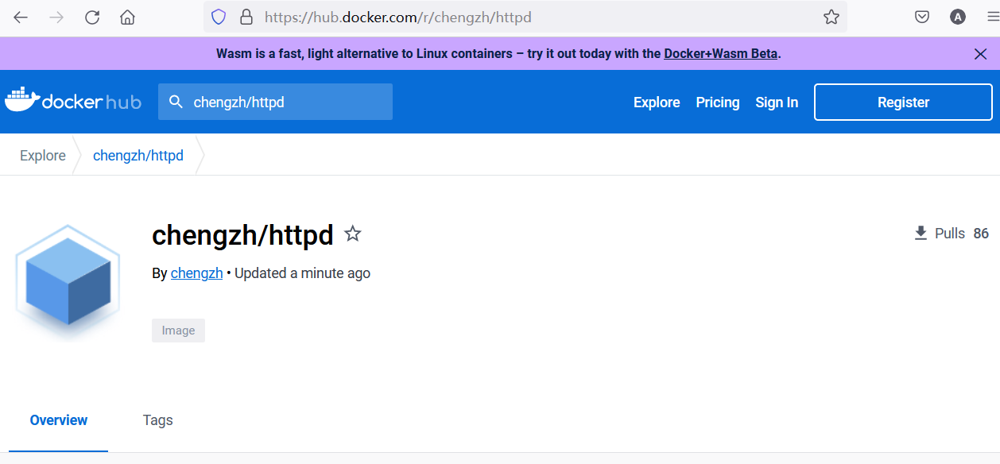
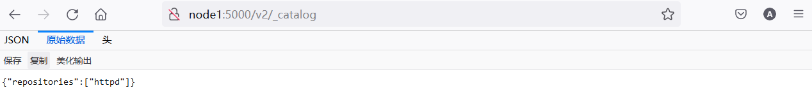

# Dockers 基本实验

实验环境最低要求：

- Ubuntu 18.04/ 1 CPU/ 2GB 内存/ 30GB磁盘

  

## Run：运行容器

安装Docker (国内场景)

```bash
apt -y install apt-transport-https ca-certificates curl software-properties-common

curl -fsSL https://mirrors.aliyun.com/docker-ce/linux/ubuntu/gpg | sudo apt-key add -
sudo add-apt-repository "deb [arch=amd64] https://mirrors.aliyun.com/docker-ce/linux/ubuntu $(lsb_release -cs) stable"

apt update -y 
apt install docker-ce -y 
```


原生常规安装Docker方法(可选)

```bash
curl -sSL https://get.docker.com/ | sh
usermod -aG docker chengzh
```


设置国内容器镜像缓存

```bash
mkdir /etc/docker
```


```bash
cat > /etc/docker/daemon.json << EOF
{
    "exec-opts": ["native.cgroupdriver=systemd"],
    "log-driver": "json-file",
    "log-opts": {
        "max-size": "100m",
        "max-file": "10"
    },
    "registry-mirrors": ["https://pqbap4ya.mirror.aliyuncs.com"]
}
EOF
```


```bash
systemctl restart docker
systemctl enable docker
```


查看docker 安装情况

```bash
docker version
```


```bash
root@node1:~# docker version
Client:
 Version:           20.10.12
 API version:       1.41
 Go version:        go1.16.2
 Git commit:        20.10.12-0ubuntu2~20.04.1
 Built:             Wed Apr  6 02:14:38 2022
 OS/Arch:           linux/amd64
 Context:           default
 Experimental:      true

Server:
 Engine:
  Version:          20.10.12
  API version:      1.41 (minimum version 1.12)
  Go version:       go1.16.2
  Git commit:       20.10.12-0ubuntu2~20.04.1
  Built:            Thu Feb 10 15:03:35 2022
  OS/Arch:          linux/amd64
  Experimental:     false
 containerd:
  Version:          1.5.9-0ubuntu1~20.04.6
  GitCommit:
 runc:
  Version:          1.1.0-0ubuntu1~20.04.2
  GitCommit:
 docker-init:
  Version:          0.19.0
  GitCommit:
```


基本映像操作

```bash
docker run -d -p 2048:80 alexwhen/docker-2048
```


```bash
root@node1:~# docker run -d -p 2048:80 alexwhen/docker-2048
Unable to find image 'alexwhen/docker-2048:latest' locally
latest: Pulling from alexwhen/docker-2048
Image docker.io/alexwhen/docker-2048:latest uses outdated schema1 manifest format. Please upgrade to a schema2 image for better future compatibility. More information at https://docs.docker.com/registry/spec/deprecated-schema-v1/
c862d82a67a2: Pull complete
a3ed95caeb02: Pull complete
69dbbd8c451d: Pull complete
e9b345a0f742: Pull complete
Digest: sha256:4913452e5bd092db9c8b005523127b8f62821867021e23a9acb1ae0f7d2432e1
Status: Downloaded newer image for alexwhen/docker-2048:latest
86b69fa85bc9a156384de0139f6cb722c37044c7e5436fe51a3a48b966b289f5
```


在宿主机上检查容器运行情况

```bash
docker ps
```


```bash
root@node1:~# docker ps
CONTAINER ID   IMAGE                  COMMAND                  CREATED          STATUS          PORTS                                   NAMES
86b69fa85bc9   alexwhen/docker-2048   "nginx -g 'daemon of…"   26 seconds ago   Up 25 seconds   0.0.0.0:2048->80/tcp, :::2048->80/tcp   busy_ride
```

重点关注上述输出的 `CONTAINER ID` 的值


查看映像

```bash
docker images
```


```bash
REPOSITORY             TAG       IMAGE ID       CREATED       SIZE
alexwhen/docker-2048   latest    7929bcd70e47   7 years ago   8.02MB
```


在浏览器上看看它长啥样


查看容器资源使用情况

```bash
docker stats
```


```bash
CONTAINER ID   NAME        CPU %     MEM USAGE / LIMIT     MEM %     NET I/O       BLOCK I/O   PIDS
86b69fa85bc9   busy_ride   0.00%     2.328MiB / 7.771GiB   0.03%     1.32kB / 0B   0B / 0B     2
```


看看2048容器内部的进程使用情况

```bash
docker top container ID
```


```bash
root@node1:~# docker top 86
UID                 PID                 PPID                C                   STIME               TTY                 TIME                CMD
root                26953               26929               0                   09:21               ?                   00:00:00            nginx: master process nginx -g daemon off;
systemd+            26991               26953               0                   09:21               ?                   00:00:00            nginx: worker process
```


如果有必要我们可以重启容器

```bash
docker restart container ID
```


```bash
root@node1:~# docker restart 86
86
root@node1:~# docker ps
CONTAINER ID   IMAGE                  COMMAND                  CREATED         STATUS          PORTS                                   NAMES
86b69fa85bc9   alexwhen/docker-2048   "nginx -g 'daemon of…"   9 minutes ago   Up 10 seconds   0.0.0.0:2048->80/tcp, :::2048->80/tcp   busy_ride
```


还可以停止容器

```bash
docker stop container ID
```


```bash
root@node1:~# docker stop 86
86
root@node1:~# docker ps
CONTAINER ID   IMAGE     COMMAND   CREATED   STATUS    PORTS     NAMES
```


因为docker ps只能看到活着的容器，如果不论死活都要看到则需要使用：

```bash
docker ps -a -q
```


```bash
root@node1:~# docker ps -a -q
86b69fa85bc9
```


如果需要启动之前被停止的容器

```bash
docker start container ID
```


```bash
root@node1:~# docker start 86
86
root@node1:~# docker ps
CONTAINER ID   IMAGE                  COMMAND                  CREATED          STATUS         PORTS                                   NAMES
86b69fa85bc9   alexwhen/docker-2048   "nginx -g 'daemon of…"   11 minutes ago   Up 5 seconds   0.0.0.0:2048->80/tcp, :::2048->80/tcp   busy_ride
```


运行更多容器

```bash
docker run -d -p 80:80 httpd
docker run -d -p 8000:80 tutum/wordpress
docker run -d -p 8080:80 dorowu/ubuntu-desktop-lxde-vnc
```


好了我们盘点这些大宝贝

```bash
docker ps

docker images
```


```bash
root@node1:~# docker ps
CONTAINER ID   IMAGE                            COMMAND                  CREATED             STATUS                   PORTS                                             NAMES
b8f97d31c80a   dorowu/ubuntu-desktop-lxde-vnc   "/startup.sh"            5 minutes ago       Up 5 minutes (healthy)   0.0.0.0:8080->80/tcp, :::8080->80/tcp             busy_zhukovsky
8bb09fdae118   tutum/wordpress                  "/run.sh"                17 minutes ago      Up 17 minutes            3306/tcp, 0.0.0.0:8000->80/tcp, :::8000->80/tcp   peaceful_tereshkova
95c53b5de2a7   httpd                            "httpd-foreground"       40 minutes ago      Up 40 minutes            0.0.0.0:80->80/tcp, :::80->80/tcp                 heuristic_meitner
86b69fa85bc9   alexwhen/docker-2048             "nginx -g 'daemon of…"   About an hour ago   Up 49 minutes            0.0.0.0:2048->80/tcp, :::2048->80/tcp             busy_ride
root@node1:~#
root@node1:~# docker images
REPOSITORY                       TAG       IMAGE ID       CREATED         SIZE
httpd                            latest    157dcdf23d6c   13 days ago     145MB
dorowu/ubuntu-desktop-lxde-vnc   latest    1a89db715923   20 months ago   1.32GB
tutum/wordpress                  latest    7e7f97a602ff   6 years ago     477MB
alexwhen/docker-2048             latest    7929bcd70e47   7 years ago     8.02MB
```


看看谁耗资源最多

```bash
docker stats
```


```bash
CONTAINER ID   NAME                  CPU %     MEM USAGE / LIMIT     MEM %     NET I/O       BLOCK I/O     PIDS
b8f97d31c80a   busy_zhukovsky        0.12%     121.1MiB / 7.771GiB   1.52%     936B / 0B     0B / 13.7MB   25
8bb09fdae118   peaceful_tereshkova   0.04%     80.75MiB / 7.771GiB   1.01%     1.01kB / 0B   0B / 39.1MB   24
95c53b5de2a7   heuristic_meitner     0.01%     6.41MiB / 7.771GiB    0.08%     1.15kB / 0B   0B / 0B       82
86b69fa85bc9   busy_ride             0.00%     2.234MiB / 7.771GiB   0.03%     1.37kB / 0B   0B / 0B       2
```


清空容器，无论死活

```bash
docker stop $(docker ps -a -q);docker rm $(docker ps -a -q)
```


```bash
root@node1:~# docker stop $(docker ps -a -q);docker rm $(docker ps -a -q)
b8f97d31c80a
8bb09fdae118
95c53b5de2a7
86b69fa85bc9
b8f97d31c80a
8bb09fdae118
95c53b5de2a7
86b69fa85bc9
root@node1:~# docker ps
CONTAINER ID   IMAGE     COMMAND   CREATED   STATUS    PORTS     NAMES
root@node1:~# docker images
REPOSITORY                       TAG       IMAGE ID       CREATED         SIZE
httpd                            latest    157dcdf23d6c   13 days ago     145MB
dorowu/ubuntu-desktop-lxde-vnc   latest    1a89db715923   20 months ago   1.32GB
tutum/wordpress                  latest    7e7f97a602ff   6 years ago     477MB
alexwhen/docker-2048             latest    7929bcd70e47   7 years ago     8.02MB
```

注意, 容器被清理,但是映像得以保留,并用于后续场景


##  Build： 构建容器镜像


先运行一个现成的容器,为方便后续操作,给容器命名为`myhttpd`

```bash
docker run -d --name myhttpd -p 80:80 httpd
```


查看容器列表

```bash
docker ps
```


```bash
root@node1:~# docker ps
CONTAINER ID   IMAGE     COMMAND              CREATED              STATUS              PORTS                               NAMES
5643afd38eb1   httpd     "httpd-foreground"   About a minute ago   Up About a minute   0.0.0.0:80->80/tcp, :::80->80/tcp   myhttpd
```


尝试使用curl访问该容器

```bash
curl localhost
```


```bash
root@node1:~# curl localhost
<html><body><h1>It works!</h1></body></html>
```


查看映像列表

```bash
docker images
```


```bash
root@node1:~# docker images
REPOSITORY                       TAG       IMAGE ID       CREATED         SIZE
httpd                            latest    157dcdf23d6c   13 days ago     145MB
dorowu/ubuntu-desktop-lxde-vnc   latest    1a89db715923   20 months ago   1.32GB
tutum/wordpress                  latest    7e7f97a602ff   6 years ago     477MB
alexwhen/docker-2048             latest    7929bcd70e47   7 years ago     8.02MB
```


看看这个映像文件的分层结构

```bash
docker image history httpd
```


```bash
root@node1:~# docker image history httpd
IMAGE          CREATED       CREATED BY                                      SIZE      COMMENT
157dcdf23d6c   13 days ago   /bin/sh -c #(nop)  CMD ["httpd-foreground"]     0B
<missing>      13 days ago   /bin/sh -c #(nop)  EXPOSE 80                    0B
<missing>      13 days ago   /bin/sh -c #(nop) COPY file:c432ff61c4993ecd…   138B
<missing>      13 days ago   /bin/sh -c #(nop)  STOPSIGNAL SIGWINCH          0B
<missing>      13 days ago   /bin/sh -c set -eux;   savedAptMark="$(apt-m…   59.9MB
<missing>      13 days ago   /bin/sh -c #(nop)  ENV HTTPD_PATCHES=           0B
<missing>      13 days ago   /bin/sh -c #(nop)  ENV HTTPD_SHA256=eb397fee…   0B
<missing>      13 days ago   /bin/sh -c #(nop)  ENV HTTPD_VERSION=2.4.54     0B
<missing>      13 days ago   /bin/sh -c set -eux;  apt-get update;  apt-g…   4.76MB
<missing>      13 days ago   /bin/sh -c #(nop) WORKDIR /usr/local/apache2    0B
<missing>      13 days ago   /bin/sh -c mkdir -p "$HTTPD_PREFIX"  && chow…   0B
<missing>      13 days ago   /bin/sh -c #(nop)  ENV PATH=/usr/local/apach…   0B
<missing>      13 days ago   /bin/sh -c #(nop)  ENV HTTPD_PREFIX=/usr/loc…   0B
<missing>      2 weeks ago   /bin/sh -c #(nop)  CMD ["bash"]                 0B
<missing>      2 weeks ago   /bin/sh -c #(nop) ADD file:1f1efd56601ebc26a…   80.5MB
```


针对httpd映像执行交互式操作

```bash
docker exec -it myhttpd bash
```


```bash
root@5643afd38eb1:/usr/local/apache2# dir
bin  build  cgi-bin  conf  error  htdocs  icons  include  logs  modules
root@5643afd38eb1:/usr/local/apache2# cd htdocs
root@5643afd38eb1:/usr/local/apache2/htdocs# dir
index.html
root@5643afd38eb1:/usr/local/apache2/htdocs# pwd
/usr/local/apache2/htdocs
```


为了修改这个html文件，我们得安装文本编辑器，比如nano

```bash
apt-get update && apt-get install -y nano
```


好了准备进行编辑

```bash
nano index.html
```


在初始形态上,随便加几个字

```html
<html><body><h1>Today is very happy!</h1></body></html>
```


修改好之后退出与容器的交互模式

```bash
root@5643afd38eb1:/usr/local/apache2/htdocs# exit
exit
```


查看更改后的效果

```bash
 curl localhost
```


```bash
root@node1:~# curl localhost
<html><body><h1>Today is very happy! </h1></body></html>
```


赶紧把咱的劳动成果也固化成映像，供之后复用

```bash
docker commit myhttpd httpdnew
```


查看映像列表

```bash
docker images
```


```bash
root@node1:~# docker images
REPOSITORY                       TAG       IMAGE ID       CREATED          SIZE
httpdnew                         latest    d079e3dd8acf   13 seconds ago   165MB
httpd                            latest    157dcdf23d6c   13 days ago      145MB
dorowu/ubuntu-desktop-lxde-vnc   latest    1a89db715923   20 months ago    1.32GB
tutum/wordpress                  latest    7e7f97a602ff   6 years ago      477MB
alexwhen/docker-2048             latest    7929bcd70e47   7 years ago      8.02MB
```

特别关注`httpdnew`的`size`


查看新映像的图层历史

```bash
docker image history httpdnew
```


看看新映像具体的效果

```bash
docker run -d -p 81:80 httpdnew
```


```bash
root@node1:~# docker image history httpdnew
IMAGE          CREATED              CREATED BY                                      SIZE      COMMENT
d079e3dd8acf   About a minute ago   httpd-foreground                                20MB
157dcdf23d6c   13 days ago          /bin/sh -c #(nop)  CMD ["httpd-foreground"]     0B
<missing>      13 days ago          /bin/sh -c #(nop)  EXPOSE 80                    0B
<missing>      13 days ago          /bin/sh -c #(nop) COPY file:c432ff61c4993ecd…   138B
<missing>      13 days ago          /bin/sh -c #(nop)  STOPSIGNAL SIGWINCH          0B
<missing>      13 days ago          /bin/sh -c set -eux;   savedAptMark="$(apt-m…   59.9MB
<missing>      13 days ago          /bin/sh -c #(nop)  ENV HTTPD_PATCHES=           0B
<missing>      13 days ago          /bin/sh -c #(nop)  ENV HTTPD_SHA256=eb397fee…   0B
<missing>      13 days ago          /bin/sh -c #(nop)  ENV HTTPD_VERSION=2.4.54     0B
<missing>      13 days ago          /bin/sh -c set -eux;  apt-get update;  apt-g…   4.76MB
<missing>      13 days ago          /bin/sh -c #(nop) WORKDIR /usr/local/apache2    0B
<missing>      13 days ago          /bin/sh -c mkdir -p "$HTTPD_PREFIX"  && chow…   0B
<missing>      13 days ago          /bin/sh -c #(nop)  ENV PATH=/usr/local/apach…   0B
<missing>      13 days ago          /bin/sh -c #(nop)  ENV HTTPD_PREFIX=/usr/loc…   0B
<missing>      2 weeks ago          /bin/sh -c #(nop)  CMD ["bash"]                 0B
<missing>      2 weeks ago          /bin/sh -c #(nop) ADD file:1f1efd56601ebc26a…   80.5MB
```


开始下一程之前，我们和过去小别

```bash
docker stop $(docker ps -a -q);docker rm $(docker ps -a -q)
```


创建httpd实验文件夹

```bash
mkdir httpd
```


进入到实验文件夹

```bash
cd httpd
```


创建index文件

```bash
nano index.html
```


创建index文件

```html
<html><body><h1>Build Ship and Run!</h1></body></html>
```


创建Dockerfile文件

```bash
nano Dockerfile 
```


```bash
FROM httpd

MAINTAINER Abraham Cheng 

COPY . /usr/local/apache2/htdocs
```


构建映像,千万不要忽略后面的那个点 `.`

```bash
docker build -t myhttpd .
```


```bash
root@node1:~/httpd# docker build -t myhttpd .
Sending build context to Docker daemon  3.072kB
Step 1/3 : FROM httpd
 ---> 157dcdf23d6c
Step 2/3 : MAINTAINER Abraham Cheng
 ---> Running in 1e8dbfa84956
Removing intermediate container 1e8dbfa84956
 ---> d2e5d1c35eaf
Step 3/3 : COPY . /usr/local/apache2/htdocs
 ---> b15f80031aa4
Successfully built b15f80031aa4
Successfully tagged myhttpd:latest
```


运行容器查看效果

```bash
docker run -d -p 80:80 myhttpd
```


```bash
curl localhost
```


```bash
root@node1:~/httpd# curl localhost
<html><body><h1>Build Ship and Run!</h1></body></html>
```


查看映像列表和新建映像图层历史

```bash
docker images
```


```bash
docker history myhttpd 
```


```bash
root@node1:~/httpd# docker images
REPOSITORY                       TAG       IMAGE ID       CREATED         SIZE
myhttpd                          latest    b15f80031aa4   2 minutes ago   145MB
httpdnew                         latest    d079e3dd8acf   9 minutes ago   165MB
httpd                            latest    157dcdf23d6c   13 days ago     145MB
dorowu/ubuntu-desktop-lxde-vnc   latest    1a89db715923   20 months ago   1.32GB
tutum/wordpress                  latest    7e7f97a602ff   6 years ago     477MB
alexwhen/docker-2048             latest    7929bcd70e47   7 years ago     8.02MB
root@node1:~/httpd# docker history myhttpd
IMAGE          CREATED         CREATED BY                                      SIZE      COMMENT
b15f80031aa4   2 minutes ago   /bin/sh -c #(nop) COPY dir:581fd85bc3c126c33…   127B
d2e5d1c35eaf   2 minutes ago   /bin/sh -c #(nop)  MAINTAINER Abraham Cheng     0B
157dcdf23d6c   13 days ago     /bin/sh -c #(nop)  CMD ["httpd-foreground"]     0B
<missing>      13 days ago     /bin/sh -c #(nop)  EXPOSE 80                    0B
<missing>      13 days ago     /bin/sh -c #(nop) COPY file:c432ff61c4993ecd…   138B
<missing>      13 days ago     /bin/sh -c #(nop)  STOPSIGNAL SIGWINCH          0B
<missing>      13 days ago     /bin/sh -c set -eux;   savedAptMark="$(apt-m…   59.9MB
<missing>      13 days ago     /bin/sh -c #(nop)  ENV HTTPD_PATCHES=           0B
<missing>      13 days ago     /bin/sh -c #(nop)  ENV HTTPD_SHA256=eb397fee…   0B
<missing>      13 days ago     /bin/sh -c #(nop)  ENV HTTPD_VERSION=2.4.54     0B
<missing>      13 days ago     /bin/sh -c set -eux;  apt-get update;  apt-g…   4.76MB
<missing>      13 days ago     /bin/sh -c #(nop) WORKDIR /usr/local/apache2    0B
<missing>      13 days ago     /bin/sh -c mkdir -p "$HTTPD_PREFIX"  && chow…   0B
<missing>      13 days ago     /bin/sh -c #(nop)  ENV PATH=/usr/local/apach…   0B
<missing>      13 days ago     /bin/sh -c #(nop)  ENV HTTPD_PREFIX=/usr/loc…   0B
<missing>      2 weeks ago     /bin/sh -c #(nop)  CMD ["bash"]                 0B
<missing>      2 weeks ago     /bin/sh -c #(nop) ADD file:1f1efd56601ebc26a…   80.5MB
```


大杀器,清理容器,但是不清理镜像

```bash
docker stop $(docker ps -a -q);docker rm $(docker ps -a -q)
```


## Ship：传输容器镜像


登陆到docker hub并推送映像

```bash
docker login
```


```bash
root@node1:~/httpd# docker login
Login with your Docker ID to push and pull images from Docker Hub. If you don't have a Docker ID, head over to https://hub.docker.com to create one.
Username: chengzh
Password:
WARNING! Your password will be stored unencrypted in /root/.docker/config.json.
Configure a credential helper to remove this warning. See
https://docs.docker.com/engine/reference/commandline/login/#credentials-store

Login Succeeded
```


给新映像打tag

```bash
docker tag myhttpd chengzh/httpd
```


```bash
root@node1:~/httpd# docker tag myhttpd chengzh/httpd
root@node1:~/httpd# docker images
REPOSITORY                       TAG       IMAGE ID       CREATED          SIZE
chengzh/httpd                    latest    b15f80031aa4   11 minutes ago   145MB
myhttpd                          latest    b15f80031aa4   11 minutes ago   145MB
httpdnew                         latest    d079e3dd8acf   18 minutes ago   165MB
httpd                            latest    157dcdf23d6c   13 days ago      145MB
dorowu/ubuntu-desktop-lxde-vnc   latest    1a89db715923   20 months ago    1.32GB
tutum/wordpress                  latest    7e7f97a602ff   6 years ago      477MB
alexwhen/docker-2048             latest    7929bcd70e47   7 years ago      8.02MB
```

重点关注 `chengzh/httpd`  


推送映像到docker hub

```bash
docker push chengzh/httpd
```


```bash
root@node1:~/httpd# docker push chengzh/httpd
Using default tag: latest
The push refers to repository [docker.io/chengzh/httpd]
d0a01e29609a: Pushed
df40ccf15557: Mounted from library/httpd
10d8cd84bc49: Mounted from library/httpd
8bb2d8abcb18: Mounted from library/httpd
2bccf7e3b941: Mounted from library/httpd
b5ebffba54d3: Mounted from library/httpd
latest: digest: sha256:a2dc4e63cc2938857a974d3f1721446239468d33ba95325054878198465acbcb size: 1573
```


在页面上进行确认




安装私有映像库

```bash
docker run -d -p 5000:5000 -v /usr/local/registry:/var/lib/registry --restart=always --name registry registry:2
```


```bash
root@node1:~/httpd# docker run -d -p 5000:5000 -v /usr/local/registry:/var/lib/registry --restart=always --name registry registry:2
Unable to find image 'registry:2' locally
2: Pulling from library/registry
ca7dd9ec2225: Pull complete
c41ae7ad2b39: Pull complete
1ed0fc8a6161: Pull complete
21df229223d2: Pull complete
626897ccab21: Pull complete
Digest: sha256:ce14a6258f37702ff3cd92232a6f5b81ace542d9f1631966999e9f7c1ee6ddba
Status: Downloaded newer image for registry:2
835c71ecf3383a1af10bfbd189b0f47f91684f07d4b5f0e9374d163ab2764c02
root@node1:~/httpd# docker ps
CONTAINER ID   IMAGE        COMMAND                  CREATED          STATUS          PORTS                                       NAMES
835c71ecf338   registry:2   "/entrypoint.sh /etc…"   28 seconds ago   Up 27 seconds   0.0.0.0:5000->5000/tcp, :::5000->5000/tcp   registry
871c0232d678   myhttpd      "httpd-foreground"       16 minutes ago   Up 16 minutes   0.0.0.0:80->80/tcp, :::80->80/tcp           interesting_nobel
```


再次给映像打标签,使其匹配私有映像的地址

```bash
docker tag chengzh/httpd localhost:5000/httpd:v1.0
```


再次查看映像并找茬

```bash
docker images
```


```bash
root@node1:~/httpd# docker images
REPOSITORY                       TAG       IMAGE ID       CREATED          SIZE
chengzh/httpd                    latest    b15f80031aa4   17 minutes ago   145MB
myhttpd                          latest    b15f80031aa4   17 minutes ago   145MB
localhost:5000/httpd             v1.0      b15f80031aa4   17 minutes ago   145MB
httpdnew                         latest    d079e3dd8acf   25 minutes ago   165MB
httpd                            latest    157dcdf23d6c   13 days ago      145MB
registry                         2         81c944c2288b   5 weeks ago      24.1MB
dorowu/ubuntu-desktop-lxde-vnc   latest    1a89db715923   20 months ago    1.32GB
tutum/wordpress                  latest    7e7f97a602ff   6 years ago      477MB
alexwhen/docker-2048             latest    7929bcd70e47   7 years ago      8.02MB
```


将映像上传到本地映像库

```bash
docker push localhost:5000/httpd:v1.0
```


```
root@node1:~/httpd# docker push localhost:5000/httpd:v1.0
The push refers to repository [localhost:5000/httpd]
d0a01e29609a: Pushed
df40ccf15557: Pushed
10d8cd84bc49: Pushed
8bb2d8abcb18: Pushed
2bccf7e3b941: Pushed
b5ebffba54d3: Pushed
v1.0: digest: sha256:a2dc4e63cc2938857a974d3f1721446239468d33ba95325054878198465acbcb size: 1573
```


查看映像catalog

```bash
curl http://localhost:5000/v2/_catalog
```


```bash
root@node1:~/httpd# curl http://localhost:5000/v2/_catalog
{"repositories":["httpd"]}
```


使用浏览器进行查看




测试运行

```bash
docker run -d -p 80:80 localhost:5000/httpd:v1.0
```


```bash
docker ps
```


```bash
curl http://localhost
```


```bash
root@node1:~/httpd# docker run -d -p 80:80 localhost:5000/httpd:v1.0
ab8d22b43a7b90283e250ce9a67b55d6711655508c432dce50fc4c582791d794
root@node1:~/httpd# docker ps
CONTAINER ID   IMAGE                       COMMAND                  CREATED         STATUS         PORTS                                       NAMES
ab8d22b43a7b   localhost:5000/httpd:v1.0   "httpd-foreground"       3 seconds ago   Up 2 seconds   0.0.0.0:80->80/tcp, :::80->80/tcp           quirky_haslett
835c71ecf338   registry:2                  "/entrypoint.sh /etc…"   5 minutes ago   Up 5 minutes   0.0.0.0:5000->5000/tcp, :::5000->5000/tcp   registry
root@node1:~/httpd# curl localhost
<html><body><h1>Build Ship and Run!</h1></body></html>
```


大杀器

```bash
docker stop $(docker ps -a -q);docker rm $(docker ps -a -q)
```


# Docker 数据存储

创建index.html文件

```bash
mkdir http

cd http

nano index.html
```


```html
<html><body><h1>Go West!</h1></body></html>
```


创建使用bind mount数据卷的容器

```bash
docker run -d -p 80:80 -v ~/http:/usr/local/apache2/htdocs httpd
```


```bash
curl localhost
```


```bash
root@node1:~/http# docker run -d -p 80:80 -v ~/http:/usr/local/apache2/htdocs httpd
028743d3aa1584e7eddfd6955d7351b4d3fc3cb59b90e299269a3c1c5a5b61cd
root@node1:~/http# curl localhost
<html><body><h1>Go West!</h1></body></html>
```


尝试在宿主机修改index.html文件，并查看容器变化情况

```
nano index.html
```


```html
<html><body><h1>Go go big or go home!</h1></body></html>
```


```bash
curl localhost
```


```bash
root@node1:~/http# curl localhost
<html><body><h1>Go go big or go home!</h1></body></html>
```


使用以下命令创建使启用managed volume的容器，注意它的端口是81

```bash
docker run -d -p 81:80 -v /usr/local/apache2/htdocs httpd
```


查看容器页面

```bash
curl localhost:81
```


```bash
root@node1:~/http# curl localhost:81
<html><body><h1>It works!</h1></body></html>
```


查看容器详细配置

```
docker ps
```


```bash
CONTAINER ID   IMAGE     COMMAND              CREATED              STATUS              PORTS                               NAMES
f6fbd7a633e3   httpd     "httpd-foreground"   About a minute ago   Up About a minute   0.0.0.0:81->80/tcp, :::81->80/tcp   angry_rubin
028743d3aa15   httpd     "httpd-foreground"   7 minutes ago        Up 7 minutes        0.0.0.0:80->80/tcp, :::80->80/tcp   sad_greider
```

特别关注 `CONTAINER ID`


```bash
docker inspect container id
```


```bash
...
 "Mounts": [
            {
                "Type": "volume",
                "Name": "85b0a27fdce4f8a46831a7a826e5d4d9035985d033ee4c722468e9a77b2b3f2a",
                "Source": "/var/lib/docker/volumes/85b0a27fdce4f8a46831a7a826e5d4d9035985d033ee4c722468e9a77b2b3f2a/_data",
                "Destination": "/usr/local/apache2/htdocs",
                "Driver": "local",
                "Mode": "",
                "RW": true,
                "Propagation": ""
            }
        ],

...
```

特别关注 `source` 的属性


修改index.html，并查看结果

```bash
sudo nano source dir/index.html
```


```bash
root@node1:~/http# sudo nano /var/lib/docker/volumes/85b0a27fdce4f8a46831a7a826e5d4d9035985d033ee4c722468e9a77b2b3f2a/_data/index.html
root@node1:~/http# curl localhost:81
<html><body><h1>It works again!</h1></body></html>
```


清理现场

```bash
docker stop $(docker ps -a -q);docker rm $(docker ps -a -q)
```


# Docker 网络


在宿主机上列出所有的网络类型

```bash
docker network ls
```

 

检查bridge网络

```bash
docker inspect bridge
```


在宿主机上观察bridge 网络，注意观察veth

```bash
brctl show
```

  注意：可能需要执行安装brctl sudo apt install bridge-utils


查看宿主机网络配置，重点关注对应veth 配置细节

```bash
ip add
```


创建测试容器

```bash
docker run -d --name httpd1 httpd
```


在宿主机上观察brctl的变化

```bash
brctl show
```

 

查看新增加的veth的细节

```bash
ip add
```


在httpd1容器里观察eth0设置

```bash
docker exec -it httpd1 bash

apt-get update && apt-get install -y iproute2

ip a

exit 
```


在宿主机上观察bridge 网络，注意观察veth

```bash
docker inspect network bridge
```


创建第二个httpd容器

```bash
docker run -d --name httpd2 httpd
```


在宿主机上观察新创建的veth

```bash
brctl show
```


宿主机上查看 veth 连接信息

```bash
ip link
```


在容器内部查看veth pair 信息

```bash
docker exec -it httpd2 bash

cat /sys/class/net/eth0/iflink
```


创建自定义网络

```bash
docker network create --driver bridge --subnet 172.22.16.0/24 --gateway 172.22.16.1 mynetwork
```


检查mynetwork配置

```bash
docker network inspect mynetwork
```


创建容器使用新建的自定义网络

```bash
docker run -d -p 83:80 --network=mynetwork --name httpd3 httpd
```


检查httpd3容器ip地址

```bash
docker exec -it httpd3 bash

apt-get update && apt-get install -y iproute2

ip add

exit
```


在宿主机上为前述httpd1容器创建第二块网卡使其连接到mynetwork

```bash
docker network connect mynetwork httpd1
```


检查双网卡容器httpd1的网络设置，重点观察mynetwork的相关配置

```bash
docker container inspect httpd1
```


在 httpd3 中ping httpd1

```bash
docker exec -it httpd3 bash

apt-get update && apt-get install -y iputils-ping

ping 172.22.16.3

apt-get update && apt-get install -y traceroute

traceroute 172.22.16.3

exit
```


清理环境

```bash
docker stop $(docker ps -a -q);docker rm $(docker ps -a -q)
docker network rm mynetwork
```


再观察一下宿主机网络设置

```bash
brctl show

docker inspect bridge
```


# Docker 资源管理


合理分配，循环释放测试

```bash
docker run -it -m 300M progrium/stress --vm 1 --vm-bytes 280M
```

  需要使用ctrl c终止容器

反面例子

```bash
docker run -it -m 300M progrium/stress --vm 1 --vm-bytes 310M
```

很快内存耗尽，容器被强行终止

清理现场

```bash
docker stop $(docker ps -a -q);docker rm $(docker ps -a -q)
```

CPU分配限制

创建两个不同优先级的容器，根据宿主机cpu数量设置参数

```bash
docker run --name containerA -d  -c 1024 progrium/stress --cpu 1
docker run --name containerB -d  -c 512 progrium/stress --cpu 1
```


检查两个容器的cpu使用情况

```bash
docker stats
```


关闭容器A，再检查cpu使用情况

```bash
docker stop containerA


docker stats
```

查看容器B内部的进程

清理现场

```bash
docker stop $(docker ps -a -q);docker rm $(docker ps -a -q)
```

 

# 使用 docker-compose 部署复杂应用


安装dockers-compose

```bash
apt install docker-compose
```


创建docker-compose文件

```bash
nano docker-compose.yml
```


```yaml
version: '3.3'
services:
   db:
     image: mysql:5.7
     volumes:

   - db_data:/var/lib/mysql
     tart: always
          environment:
            MYSQL_ROOT_PASSWORD: somewordpress
            MYSQL_DATABASE: wordpress
            MYSQL_USER: wordpress
            MYSQL_PASSWORD: wordpress

   wordpress:
     depends_on:
       - db
     image: wordpress:latest
     ports:
       - "8000:80"
     restart: always
     environment:
       WORDPRESS_DB_HOST: db:3306
       WORDPRESS_DB_USER: wordpress
       WORDPRESS_DB_PASSWORD: wordpress
volumes:
    db_data:
```


运行docker-compose

```bash
docker-compose up -d
```


查看容器和映像

```bash
docker ps

docker images
```


查看docke volume

```bash
docker volume ls
```


查看db容器，重点关注mount字段

```bash
docker inspect root_db_1
```


停止容器

```bash
docker-compose down
```


# Docker 可视化管理

安装portainer

```bash
docker run -d -p 9000:9000 --restart always -v /var/run/docker.sock:/var/run/docker.sock -v /opt/portainer:/data portainer/portainer -H unix:///var/run/docker.sock
```


安装Weave scope 

```bash
sudo curl -L git.io/scope -o /usr/local/bin/scope
sudo chmod a+x /usr/local/bin/scope
sudo scope launch
```


安装Prometheus

```bash
git clone https://github.com/stefanprodan/dockprom  
cd dockprom 
ADMIN_USER=admin ADMIN_PASSWORD=admin docker-compose up -d
```

